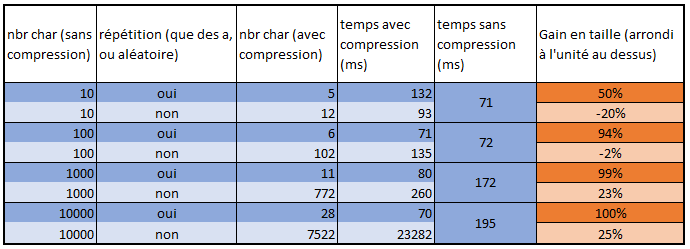

**Auteurs:** Robin GAUDIN, Lev POZNIAKOFF, Axel VALLON

**Date:** 21.11.2021

# SYM: Labo 2, Protocoles applicatifs

## 3. Manipulation

Dans un premier temps nous avons du définir plusieurs activités, appelée dans la MainActivity via un bouton. Elles sont définies dans ``ch.heigvd.sym.myapplication.activities`` et sont réparties ainsi:

- **AsynchronActivity**: Partie 3.1, transmission asynchrone
- **DeferredActivity**: Partie 3.2, transmission différée
- **SerializationActivity**: Partie 3.3, transmission d'objet (JSON, XML, ProtoBuf)
- **CompressActivity**: Partie 3.4, GraphQL FormatJSON
- **CompressActivity**: Partie 3.5, transmission compressée

Les activités ``AsynchronActivity`` et ``CompressActivity`` ont toutes 2 un toast qui s'affiche avec le temps que l'opération a pris (traitement -> envoie -> réception -> traitement) à chaque requête. La classe SymComManager contient des variables contenant des chaînes de caractères de différentes tailles à tester. Ceci était nécessaire pour les réponses aux questions.

### 3.1 Service de transmission asynchrone

L'activité ``AsynchronActivity``, contient principalement la définition de ``onCreate``. Une fonction de création de l'activité, elle définit un ``SymComManager`` pour gérer l'envoie.

``SymComManager`` va quant à elle définir une fonction ``sendRequest`` qui définit un post dans lequel la communication avec le serveur est effectuée.

### 3.2 Transmission différée

L'activité ``DeferredActivity`` défini principalement la fonction ``onCreate``. Celle-ci va définir le champ textuel à remplir pour le message, ainsi que le bouton pour envoyer. Celui-ci va ajouter le contenu du champ textuel à une queue pour l'envoi différé. Un thread est ensuite défini afin d'envoyer périodiquement les messages de la queue au serveur à travers une boucle. La queue va donc se remplir dans l'intervalle ``Utils.DEFERRED_TIMING``. Une fois ce temps dépassé, la queue est intégralement envoyée via le SymComManager.

### 3.3 Transmission d’objets

L'activité ``SerializationActivity``défini les champs nécessaires à cette partie. La fonction ``onCreate`` va définir 4 champs textuels (nom, prénom, 2e prénom(s), numéro de téléphone) ainsi que 2 lignes de checkbox avec une sélection unique, une pour la catégorie de numéro de téléphone et une pour le format de sérialisation. La définition du bouton d'envoi va prendre en compte le protocole de sérialisation utilisé pour le transmettre au ``SymComManager`` et l'envoyer au serveur dans le bon format.

### 3.4 GraphQL – Format JSON

Pour l'activité, on crée des listes et des adapter liés à notre spinner (pour les auteurs) et à notre listView (pour les livres). Sur le spinner, l'élément onItemSelectedListener est utilisé pour détecter un changement et afficher les livres liés à un auteur. Pour la récupération de la réponse, on teste si elle contient l'intitulé des requêtes (findAllAuthors) pour savoir si il faut ajuster les auteurs (à la création) ou les livres (à la création et lors d'un changement d'auteur). On remplit les listes liées aux adapter puis on notifie ce dernier qu'une modification a été effectuée afin de mettre à jour les données.

### 3.5 Transmission compressée

Au niveau de l'activité, exactement pareil que l'asynchrone, mise à part que dans l'envoi au SymComManager on rajoute un booléen pour la configuration.

Dans le SymComManager, on ajoute les en-têtes X-Network et X-Content-Encoding et on compresse le contenu uniquement si le booléen compressed est à true. A la réception, on teste si l'en-tête X-Content-Encoding a été spécifié pour savoir s'il faut décompresser le message ou non.

## 4. Questions

### 4.1 Traitement des erreurs
> Les classes et interfaces SymComManager et CommunicationEventListener, utilisées au point 3.1, restent très (et certainement trop) simples pour être utilisables dans une vraie application : que se passe-t-il si le serveur n’est pas joignable dans l’immédiat ou s’il retourne un code HTTP d’erreur ? Veuillez proposer une nouvelle version, mieux adaptée, de ces deux classes / interfaces pour vous aider à illustrer votre réponse.

Dans le cas où le serveur n'est pas joignable le, une exception sera lancée. Celle-ci sera catchée et la stack trace de l'exception sera imprimée dans les logs. Pour l'utilisateur, aucun message ou indication de l'erreur n'apparaîtra puisque la seule trace se trouvera dans les logs, et indirectement, l'absence de connexion sera indiqué l'abscense de réponse du serveur. 

Ce qui serait intéressant du côté de l'utilisateur est de prévoir éventuellement un pop-up ou un toast qui s'afficherait lorsque l'exception est lancée indiquant que le serveur est inatteignable. Afin de diversifier le message d'erreur, nous pouvons aussi envisager que SymComManager vérifie que le téléphone est connecté à internet pour transmettre un message d'erreur plus précis plutôt que de lui indiquer seulement que le serveur est injoignable

### 4.2 Authentification

> Si une authentification par le serveur est requise, peut-on utiliser un protocole asynchrone ? Quelles seraient les restrictions ? Peut-on utiliser une transmission différée ?

Oui, c'est faisable d'utiliser un protocole asynchrone en théorie, mais en pratique cela pourrait avoir des conséquences sur l'expérience de l'utilisateur. Etant donné que si une authentification est requise c'est pour accéder à du contenu accessible seulement à certaines personnes, si on attend pas la réponse du serveur il pourrait y avoir des informations manquantes, normalement disponibles à l'utilisateur.

Concernant la transmission différée, cela va un peu dans le même sens de la gêne envers les utilisateurs. Mais aussi en terme de sécurité, puisque certaines informations sensibles devraient être stockées avant l'envoi au serveur.

### 4.3 Threads concurrents

> Lors de l'utilisation de protocoles asynchrones, c'est généralement deux threads différents qui se répartissent les différentes étapes (préparation, envoi, réception et traitement des données) de la communication. Quels problèmes cela peut-il poser ?

- Nous pouvons avoir un problème lié à la concurrence dans le cas ou les 2 threads partagent la même ressource. Il faudrait considérer la mise en place de verrous afin de protéger ces dites ressources. 
- L'ordre d'exécution peut également être problématique dans la mesure où l'ordonnanceur peut exécuter le thread de réception avant le thread d'envoi. Une synchronisation doit donc être faite entre ces 2 threads.

- Nous n'avons pas de communication entre le thread d'envoi (``sendRequest``) et le thread de réception (``HandlerReponse``). Il faudrait les lier éventuellement avec un ID.

### 4.4 Ecriture différée

> Lorsque l'on implémente l'écriture différée, il arrive que l'on ait soudainement plusieurs transmissions en attente qui deviennent possibles simultanément. Comment implémenter proprement cette situation ? Voici deux possibilités :
>

> Effectuer une connexion par transmission différée 

L'utilisation d'une connexion par transmission différée peut être indiquée dans le cadre de l'envoi de fichiers volumineux ou si nous somme face à une connexion instable. Les problèmes liés à cette méthode sont les suivants:

-  Cette méthode est coûteuse en ressource
- L'ordre d'envoi des données n'est pas assuré.

> Multiplexer toutes les connexions vers un même serveur en une seule connexion de transport. Dans ce dernier cas, comment implémenter le protocole applicatif, quels avantages peut-on espérer de ce multiplexage, et surtout, comment doit-on planifier les réponses du serveur lorsque ces dernières s'avèrent nécessaires ?

Le multiplexage permet de traiter plus de requête que la méthode précédente, mais aussi, facilite l'utilisation de même ressources par 2 activités différentes. Toutefois, cette méthode comporte le désavantage que si l'ensemble des requêtes est trop important, elle ne pourront pas être envoyée en une seule fois. Ce problème va s'aggraver avec le temps.

Une méthode pour régler les désavantages des 2 méthodes mentionnées est de les combiner. Ainsi nous pourrions réunir les requêtes en blocs que nous multiplexerions 

### 4.5 Transmission d’objets

> a. Quel inconvénient y a-t-il à utiliser une infrastructure de type REST/JSON n'offrant aucun service de validation (DTD, XML-schéma, WSDL) par rapport à une infrastructure comme SOAP offrant ces possibilités ? Est-ce qu’il y a en revanche des avantages que vous pouvez citer ?

L'infrastructure REST/JSON ne propose pas de validation. De ce fait nous devons contrôler la validité nous même ce qui peut rendre le processus un peu fastidieux. Toutefois si la validation n'est pas un problème, JSON est idéal. De plus le contenu généré est plus lisible et un petit peu moins lourd que le XML.

> b. Par rapport à l’API GraphQL mise à disposition pour ce laboratoire. Avez-vous constaté des points qui pourraient être améliorés pour une utilisation mobile ? Veuillez en discuter, vous pouvez élargir votre réflexion à une problématique plus large que la manipulation effectuée.

Les requêtes larges utilisent beaucoup de données. Il serait intéressant de les compresser. Conserver les réponses en cache avec une vérification que la base de données n'a pas été modifiée peut également être une option.

### 4.6 Transmission compressée

> Quel gain de compression (en volume et en temps) peut-on constater en moyenne sur des fichiers texte (xml et json sont aussi du texte) en utilisant de la compression du point 3.5 ? Vous comparerez plusieurs tailles et types de contenu, vous pouvez vous aider des valeurs «Received Size» (taille en bytes du contenu transféré) et «Payload Size» (taille en bytes du contenu après décompression) indiquées dans l’interface de logs du serveur utilisé pour les manipulations de ce laboratoire.

Nous avons décidé de comparer 2 types de contenus:

- Soit une chaîne composée exclusivement de "a"
- Soit une chaîne générée aléatoirement.

Les résultats sans compression ont été regroupés pour les 2 cas puisque nous obtenions des résultats similaires.

Les conclusions que nous pouvons en tirer sont les suivantes:

- La compression pour les petits payload n'est pas intéressante puisqu'elle fait perdre du temps inutilement (presque 2 fois plus long pour les chaìnes de taille 10 avec la compression)
- La compression va allonger la chaîne si celle-ci n'est pas assez longue et qu'elle est aléatoire (cas de la chaîne sans répétitions de taille 10 et 100)
- Sur les textes à répétition, la compression est très rentable en terme de gain en taille pour les grands textes. Il est toutefois important de rappeler que la compression a un coup temporel, ce qui ne la rend pas rentable pour les petits textes.
- Les chaînes aléatoires sont complexes à compresser avec un gain de taille qui n'excède pas les 25%. Le coût temporel est quand à lui titanesque (23 secondes pour 100000 caractères.)
