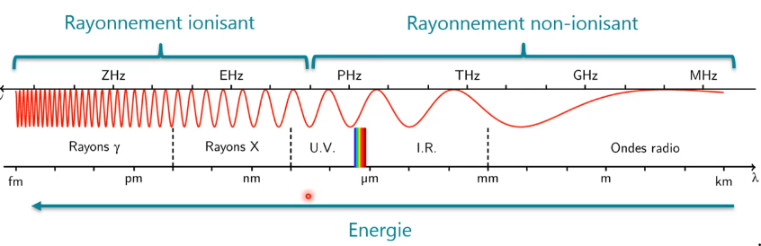

# Résumé SYM

**Défi** : Connections peu fiable, autonomies, interface restreintes, environnement local variable, appareils peuvent être perdu, sécurité hasardeuse, différents usage...

**Portabilité:** Les périphériques doivent être portables et permettre de se déplacer facilement

**Connectivité:** Possibilité de rester connecté en permanence, sans être affecté par le déplacement

**Interactivité:** Les périphériques et utilisateurs appartenant à un système informatique mobile sont interconnectés dans le but de pouvoir collaborer 

**Individualité:** adaptation de la technologie aux besoins personnels 

### OS

**iOS** dérivé de MacOS, basé sur un noyau hybride XNU (Unix) **Environnement de développement** : XCode, (un IDE, un LLVM Toolchain (Outil de compilation) et un simulateur). Il existe des alternative, mais la compilation sera effectuée par XCode, et donc sur Mac. License payant pour développement et distribution.**Windows Phone :** dead depuis fin 2019 **FireFox OS** : 0,1% des téléphone en 2014, utilisé sur TV (Panasonic), dernière version stable 2015. **Librem:** Orienté matériel. Hardware + software 100% opensource. Librem5 basé sur PureOS

### Android

Noyau Linux avec machine virtuelle dédiée (Dalvik et ensuite ART), pour isoler dans une sandbox.

**Propriété :** Multi-tâche (de base), open-source, et donc permet des surcouche des constructeur.

Multiple constructeurs mobile -> Utilisation une machine virtuelle dédiée,

Dalvik était très efficace, et ART compile toute les applications lors de l'install. Calqué sur la JDK.

Kotlin est supproté depuis 2017, et sur Android depuis 2019.

Architecture Android Open Sourc Projet (AOSP) 1. Linux Kernel (Classique, Blootooth driver ..) 2. Hardware Abstration Layer (Blutooth, Wifi...) 3. Librairie (Media Framework, Surface Manager, Libc...) 4. Application FramerWork (Serveur applicatif (Apache2), Ressource Manager, Activity Manager, Window Mannager ...) 5. Application (Application complète)

Architecture Google : Pareil avec l'Android Runtime (Core Librairie, Dalvik.. ) dans la couche librairie.

### Kotlin

Language orienté objet et fonctionnalité. Développé majoritairement par JetBrains. "Compilé" en bytecode Java (compatible JVM ou JS). Interopérabilité possible avec Java. Assez proche de Swift.

## Android

### Activité

Une activité est une unique chose que l'utilisateur peut effectuer. Presque toutes les activités interagissent avec l'utilisateur, la classe Activity s'occupe donc de créer une fenêtre pour vous dans laquelle vous pouvez placer votre interface utilisateur avec setContentView(View). Alors que les activités sont souvent présentées à l'utilisateur sous forme de fenêtres plein écran. Au besoin, elle peut être tuée par l'OS. Initialisée avec une `Intention`, qui a les paramètres important pour cette application.


### Intents

Explicite : Permet de démarrer une Activité définie, quand on a un vision claire de ce qu'on souhaite faire.

```java
Intent(applicationContext,DetailActivity::class.java)
startActivity(intent) 
// shared content
val intent = Intent(this, SecondActivity:: class.java).apply {
putExtra(“key”,”New Value”) }
startActivity(intent)
```

Implicite : Permet de démarrer une action, ce qui démarrera une action sans pour autant l'appeler. Exemple : On clique sur un boutton pour "Partager", on sait pas si l'utilisateur veut faire en blootooth, avec Gmail...

### Fragments

Partie d'une interface graphique réutilisable. Permet de partitionner une activité. Exemple d'utilisation : onglet. Chaque onglet est un fragment, et ils sont inclus dans une activité qui a tous les onglet, et sont donc tous un sous-ensemble d'une activité. Un fragment définit et gère sa propre mise en page, a son propre cycle de vie et peut gérer ses propres événements d'entrée. La hiérarchie des vues du fragment devient partie intégrante de la hiérarchie des vues de l'hôte ou s'y attache. Permet donc une grande modularité de l'interface utilisateur.

https://developer.android.com/guide/fragments

### Services

Tâche en arrière plan qui permet d'envoyer des signaux. Un service est exécuté dans le thread principal. Permet d'effectuer toutes les opérations pour lesquelle l'utilisateur n'a pas besoin d'intéragir directement, comme un téléchargement, on valide une activité pour télécharger, et le service va s'occuper de télécharger en arrière plan. Il peut aussi maintenir des connexion (mail) ou même parfois peut founir un service d'API.

### Environnement de dev

Android Studio. Vue en XML, Descriptif de l'application dans `AndroidManifest.xml` (privilège et propriété). Possibilité d'intégrer du code C/C++ (performance). Pour mitiger le problème de taille d'écran, utilisation des `Layout`. 

### Layout

Permet de définir les emplacement des éléments sur l'écran. Il existe différentes stratégies, comme du positionnement relatif (RelativeLayout ou ContraintLayout), Les un après les autre (LinearLayout), ou comme un tableau (TableLayout). Il existe une structure de layout permettant de les combinée et et les imbriquer. Il est possible de créer son propre Layout personnalisé.

```xml
<?xml version="1.0" encoding="utf-8"?>
<LinearLayout xmlns:android="http://schemas.android.com/apk/res/android" <!-- vue placé dans LineraLayout -->
              android:layout_width="match_parent" <!-- utilise tout l'espace -->
              android:layout_height="match_parent" <!-- utilise tout l'espace -->
              android:orientation="vertical" 
			  android:padding="10dp" > <!--px : pixel, pas dynmamique; in(inch) mm : valeur physique; pt 1/72 in; dp : density independant pixels : 1 dp is 1px sur 160dpi; sp scale-independant pixels -->
    <TextView android:id="@+id/text" <!-- identifiant concerné, permet link -->
              android:layout_width="wrap_content" <!-- warp_content : constant -->
              android:layout_height="wrap_content"
              android:text="Hello, I am a TextView" />
</LinearLayout>
```

Pour appliquer un layout, il faut `setContentView(R.layout.nomdufichiersansxml)` dans une activité

`findViewById(R.id.text)` permet de link le titre avec l'activité

Ensuite, on peut mettre en place des listener sur les objet linké pour traiter les interractions.

**Android JetPack **Couvre les bibliothèques qui permettent aux utilisateurs d'interagir avec l'application via l'interface utilisateur

**Programmer en android** Grand principe mobilité : Ce qui n'est pas une interaction direct et immédiate doit être délégué à un autre thread.

### Application native

Possibilité qu'une migration vers des thin client soit mise en place -> besoin de beaucoup de communication, il est possible que cette migration n'ait lieu que pour de la consultation

Il existe des applications basée sur web packagées sous la forme d'app. (Ionic(angular ou React), Adobe PhoneGap)

Ou même qui génère du code Android/iOS du même code (React Native, Xamarin, Unity3D, Goo)

Il y a des limitation lié au modules installé, il ont certaine limites

Parfois basé sur une VM, comme React. 

Que choisir ? Natif pour application complexe, et cross-plateforme pour des application "simple"

React est très mis à jour, et open source. Flutter, très documenté et facile.

Avec certains framework basé sur du JS, il est possible de faire des mises à jour de fichier, sans mise à jour complète ou revalidation. Il faut faire attention, on ne peut pas tout faire, comme par exemple chez Apple, ils sont pas ok qu'on fasse une simple application web packagée en App mobile. Il suffit de rajouter une petite fonctionnalité.

## Communication

**Relation de Shannon**
$$
C = W * log{_2}{(1 + \frac{S}{N})}
$$
Cette formule montre la limite des ondes sur le réseau. On ne peut pas exploiter sans limite le milieu air.

C : Capacité d'un canal 	W : largeur de bande S/N : cher S : valeur du signal (qualité) N : Noise -> diminue énormément avec plus de gens -> on augmente le S si beaucoup de monde, attention à la quantité d'énérgie utilisée et les limites légales

#### caractéristiques

4 caractéristiques de bonne qualité des antenne émettrice et réceptrices : le gain (type d'antenne utilisé, souvent gain = dimension ** 2), le milieu (contexte, la propagation peut être moins ou bonne, pas de contrôle dessus), distance(on peut faire qqch là) et puissance (aussi). 

2 types d'antenne : omnidirectionnelle(gain horizontal équivalent) et parabolique (une direction, pas utilisable sur smartphone, on peut pas cibler une antenne avec son phone...)

**La puissance de réception** diminue proportionnellement au carré avec la distance et la fréquence, indépendamment entre un émetteur et un recepteur

**modulation** : On peut transposer dans une modulation un signal à transmettre sur une onde qui va voyager sur trois type de modulation : L'amplitude(radio AM, message multiplié par la porteuse), la fréquence(raido FM, on varie la fréquence, on baisse si 0, et accélère si 1) et la phase (moins sensible au bruit, décalage de la porteuse si c'est des 0 ou des 1). 

**Augmentation** Plus on augmente la fréquence, plus on on peut transmettre, mais l'affaiblissement augmente au carré (courte portée) **2** Utiliser moins de largeur de bande, ex : si on a de la voix, on connait la largeur de bande **3** Essayer d'améliorer le rapport dignal/bruit (pas très maitrisable ou pas légal) **4** Utiliser des meilleurs techniques comme la 3g, 4g ...

**Problème** Batterie, polution du milieu air, structure du réseau... (nb max d'utilisateur, augmenter le signal tue des réseaux plus lointain)

#### Réseau cellulaire  

Utiliser des paternes qui permettent d'éloigner au plus possible des réseau qui utilisent les même ondes.

On aura pas la même couverture en fonction de la région, si on est dans la campagne, on utilisera moins de cellule étant donné que chaque cellule a un nombre d'utilisateur limité.

(MacroCell(campagne, forte, posée en dehors des village, 1800 personne), MicroCell(150-300m, 200 user), PicoCells(200m, 32 user)) MentoCells(maison, 4-6 user)).

#### Bande

BANDE ISM : 2.4 GHz, largeur dépassent les canaux, trop exploité mais libre de droit

Containtes : Autre onde payant à ne pas dérange, débit à satisfaire, limiter antenne visible

**GSM / Wireless Application Protocol (2G)** Différents protocoles HTTP passe à WAE (Wireless Application Environment), fournit une architecture pour la communication entre les appareils sans fil et les serveurs Web. De plus, on utilise WTP (Wireless transaction protocole). Ce protocole gère les types de connexion et la fiabilité du service. Cette couche se situe au niveau applicatif. WML est un langage à balises conçu spécifiquement pour le WAP (Wireless access point), de manière à pouvoir s'afficher sur un écran de téléphone mobile 

**UMTS / Universal Mobile Telecommuniation System (3G)** Meilleur débit, technologie à étalement de spectre, affectée à chaque cellule radio **est** de 5 MHz avec une largeur spectrale réelle de 4,685 MHz .

**LTE / Long Term Evolution** Extension de la 3g. 150 Mps théorique. Les débit en dessus de 1 MPs sont souvent bloqué par les lieu donc on en met beaucoup. Fréquence entre 800 MHZ  (LTE) et 3.8 GHz (LTE Advanced). On récupère un bout des fréquence de GSM (2G) Différents dans certains pays.

**4G** de donnée uniquement au Gbit /s, < 100ms

**5G **Débit 1 à 10 Gbps, 300'000 appareils par accès, moins gourmant en énérgie, évolutif, offre des garantié réseau, Beinforming (onde dirigée vers des utilisateur, sans arroser le reste, suit l'utilisateur). Basse fréquence (700MHz à 1.8 GHz, télephonie, IoT), ou 3.5Ghz à 3.8GHz (standard) ou même 26 à 28 GHz (Ultra haut débit). Récupération des fréquence 2G. Orienté pour tout les périphérique. < 5ms.

#### Autre

1 **Wifi** : pas un réseau, mais un protocol d'accès, car pas d'itinérance 2. Actuellement, les mobile envoient plus qu'ils reçoivent. **LoRaWAN** : réseau étendu à bat débit (0.3 à 50kbps) pour IoT. duty-cycle (on peut diffuser entre 0.1 et 1% du temps). On peut le mettre en place soit même sans demande. 

**Disponibilité du réseau** Utiliser des caches, information look-ahead, donc avoir tout en local.

**Conséquence** : **1** En émettant, on utilise la batterie(mobile 1W). **2** Si protocole basse cap, lent, pas bien pour mobile. **3** protocole applicatif de nature synchrone, donc on doit attendre la réponse, et souvent mal implémenté **4** Un bon design peut compenser ces problèmes **5** Prot app : XML-RPC concis ou REST 

**Alternative à IP** TCP/IP slow start, donc on a des latence. SMS était ok avant (sur 3g et avant). 

**Applicatif** systématiquement HTTP. SI app web, transmission présentation. Sinon, client riche

### Spectre



**Electrosmog** Polution électromagnétique. Effet : chauffe les gens.  

**DAS** Débit d'absorption spécifique, doit pas dépasser 2 W/Kg. 

## Communication internet

Pour communiquer entre les thread, il nous faut un modèle asyncrone. Depuis le thread principal (UI-Thread), et y lance le thread voulu, et on synchronise ensuite sur le thread principal quand on a la réponse. Pour faire ça, on utilise les `EventListener`, en mode observateur. En pratique, on peut créer une liste de `CommunicationEventListener` . On peut implémenter ces`listener` sur une activité.

**Problèmes** On doit pouvoir recevoir la réponse dans le thread principal. Howto: class `Handler` (ce gestionnaire permet d'envoyer et de traiter des `Message`objets exécutables associés à un thread `MessageQueue`) Moyen (1) programmer des messages et des exécutables à exécuter à un moment donné dans le futur (attention memory leaks, utiliser `WeakReference`) ; et (2) pour mettre en file d'attente une action à effectuer sur un contexte différent du vôtre.

**Notification** Si on ferme l'utilisation, on peut interagir avec l'utilisateur sans `Activity`. Quand on clique sur une notification, on démarre une `Intent`. En général, on a une pile d'activité pour que l'utilisateur ait un état cohérent lorsqu'il clique dessus, afin de simuler ce qui devrait ce passer pour aller dessus. Si elle existe déjà, on va simplement aller dessus. Les notifications ont un ID, pour les mettre à jour. Il est possible de mettre plusieurs Intent sur une Notification (Ex, ouvrir What's app, ou répondre).

**Sérialisation** On veut des objets complet, pour les sérialiser et déserialiser. On utilise en HTTP pour envoyer en clair du XML(verbeux, lisible, un peu auto-documenté et peut être validé(XSchema ou DTD)) ou du JSON (Compact, concis). Problème, pas optimisé (chiffre ou bool en String). On peut donc utiliser ProtoCol Buffers pour envoyer en en `ByteArray`. Existe pour PHP, Swift, Scala, etc... Aucun champ n'est obligatoire depuis la version 3. Utile pour chiffre et bool principalement. 

**Serialisation XML** Outils bien des fois, ou pas. Peut être complexe, comme SAX(event). Bien pour XPath ou XSL. Xstream déconseillé, car si il y a des changement de nom de variable ça suit pas.

**Serialisation JSON** Gson(Google), mais peut ne pas être adaptée, car aucun contrôle de cohérence, et type problématique(date). des champs manquant ou non renseigné ne seront pas traité. Si on a du JS, très pratique car on peut travailler avec ça comme un objet.

**Introspection en java** : On prend un Objet de type inconnu, et on regarde tout ce qui la constitue. On charge dynamiquement avec `Class.forName("org.wikibooks.fr.NomdeLaClasse")` ... Pas besoin du coup de compiler la classe.

**Réflexion en java** On prend un Objet de type inconnu, et on modifie la structure

**Services web** Google a une approche REST, alors que les autre plus RPC / SOAP (lourd, intéressent pour des approches contrôlée) **XML-RPC** RPC : Remote Procedure Call. Format XML spécifique, pas ouf, car encore plus verbeux que XML, donc peut utiliser comme tel, mais plus utilisé pour des question/réponse facile. JSON-RPC fait la même. **SOAP** Plus de contrainte, beaucoup plus robuste (Utilisation de XMLSchema). Utilise **WSDL** (Web Service Description Language) permet de gérer du code client et/ou serveur. Standarisé. Pas assez mature sur mobile. Très lourd et très verbeux, mais strong. **RESTful** Sans état, mise en cache, chaque ressource a une URI, séparation client/serveur. Souvent utilisé pour des ressource dans une DB. **GraphQL** langage de requête alternatif au API REST, qui permet de préciser le type de retour. **under-fetching** : pas assez d'infos **over-fetching** : bien vu en Mobile, tout d'un coup. Exemple `{ hero { name } }` retourne `{ "data": { "hero": { "name": "R2-D2" } }}` possiblité de mettre de vraiment spécifier ce qu'on a besoin.

**Objet volumineux** Attention aux objet trop gros, cas si la co quitte, ça recommence, donc on essaie de diminuer le payload ou partitionner les donnée. 

**Compression** Avec HTTP (fait pas partie du protocole), on peut compresser le contenu à l'envoi. Il faut que le serveur et le client compresse et décompresse. Seulement utile pour du texte.

**Sécurité **Au moins SSL, avec une vérification du certificat côté client, on doit rajouter un échange de token ou l'utilisation d'une clé privée. 

### Serveur à client

**Problématique** Ip inconnue, l'IP change tout le temps, firewall, NAT

**Solution : Connection active** Implique des technique de l'Active Poll pour conserver au mieux la connexion. Utilisé par les jeu vidéo. Implémentation: Socket TCP/IP, Websockets...

**Solution : Active Poll** Lance périodiquement une requête. SI il y a du contenu, on reçoit une réponse. Intéreressant si pas trop souvent. Pour la batterie, il existe des norme des politiques strictes. Possibilité de faire des requête que pendant un temps défini par l'OS. (Doze) Avec `App Standby Buckets `, les app sont classifié par leur temps d'utilisation `Active`, `Working set bocket`, `Frequent Bucket `... On peut programmer des exécution de Thread avec `ExecutorService`en Java, et Android spécifie `AlarmMangager` et permet d'emettre des Intent. `JobScheduler` plus poussé, plus configurable, moins de bug. v >= 21. Android Jetpack propose `WorkManager` est centralise toute ces possibilités dans une API.

**Solution : Lazy Poll** Quand le client envoie des donnée, le serveur profite de la réponse pour envoyer ce qu'il doit envoyer

**Solution : Poll on request** On envoie via le réseau téléphone l'information. Opérateur doit être ok avec ça. Google propose `cloud messaging`. pas sécurisé, donc qu'une Intent est envoyé. Il faut les Google Play Services.